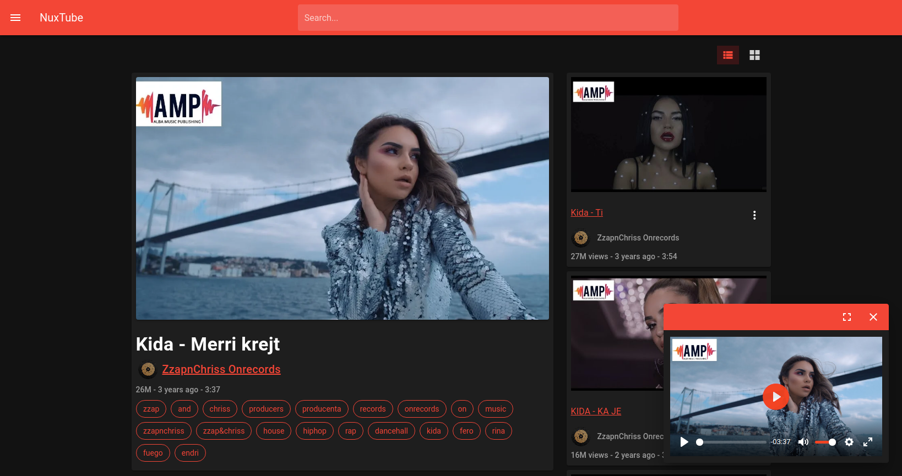
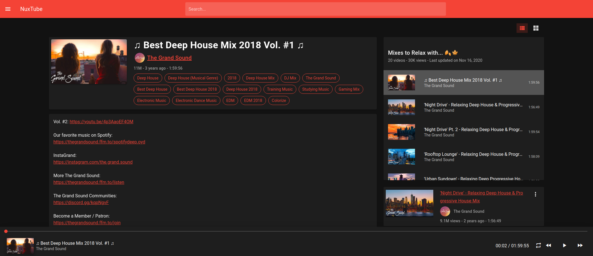

# NuxTube
NuxTube is an open source YouTube player for private usage without ads.

# how does it work?
NuxTube is made using [nuxtjs](https://nuxtjs.org/) and built-in restful Api.

# Notes
If you are using mysql <5.7.5 you should set this global variable in order for history to work.
```bash
SET GLOBAL sql_mode=(SELECT REPLACE(@@sql_mode,'ONLY_FULL_GROUP_BY',''));
```
or edit ```/etc/mysql/my.cnf``` and paste these 2 lines at the end of the file
```
[mysqld]
sql_mode = "STRICT_TRANS_TABLES,NO_ZERO_IN_DATE,NO_ZERO_DATE,ERROR_FOR_DIVISION_BY_ZERO,NO_ENGINE_SUBSTITUTION"
```
- MySql database is included in the database folder, don't forget to import it, only structures are exported.
- Hover over the thumbnail in the player page to open the video player.

## Features
- Search with continuations
- Search Suggestions
- Audio and Video Player
- Channel browsing (Home, Videos, Playlists)
- Playlist Fetching
- Playlist Playing
- History
- Parse related videos with continuations
- Audio or Video Downloads
- Block or remove specific video
## WIP
- Create Playlists
- Trending Page


### Search


### Player




### Player Playlist


### Channel


### Playlist


## Build Setup

```bash
# install dependencies
$ npm install

# serve with hot reload at localhost:3000
$ npm run dev

# build for production and launch server
$ npm run build
$ npm run start

# generate static project
$ npm run generate
```