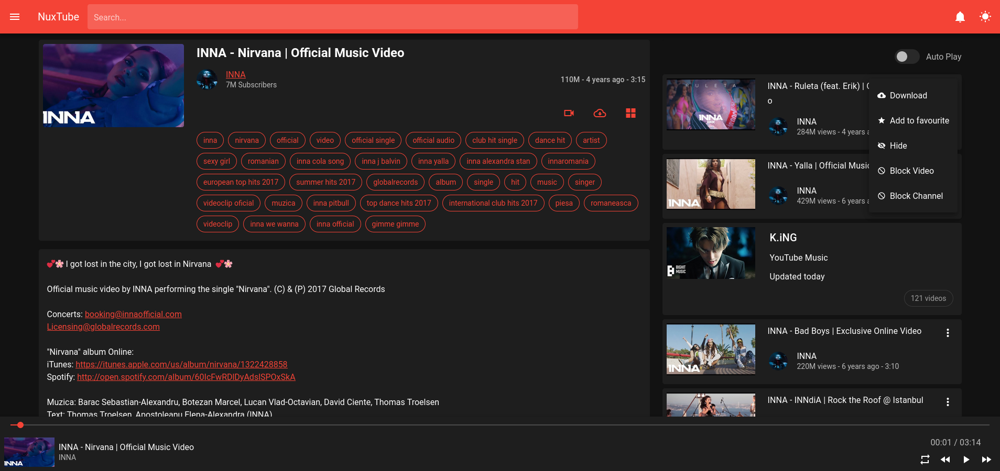

# NuxTube
NuxTube is an open source YouTube player for private usage without ads.

# how does it work?
NuxTube is made using [nuxtjs](https://nuxtjs.org/) and built-in restful Api.

# Notes
If you are using mysql <5.7.5 you should set this global variable in order history to work.
```bash
SET GLOBAL sql_mode=(SELECT REPLACE(@@sql_mode,'ONLY_FULL_GROUP_BY',''));
```
MySql database is included in the database folder, don't forget to import it, only structures are exported

## Features
- Search with continuations
- Search Suggestions
- Audio and Video Player
- Channel browsing (Home, Videos, Playlists)
- Playlist Fetching
- Playlist Playing
- History
- parse related videos with continuations

## WIP
- Audio or Video Downloads
- Create Playlists
- Block or remove specific video
- Trending Page


### Search


### Player



### Player Playlist


### Channel


### Playlist


## Build Setup

```bash
# install dependencies
$ npm install

# serve with hot reload at localhost:3000
$ npm run dev

# build for production and launch server
$ npm run build
$ npm run start

# generate static project
$ npm run generate
```